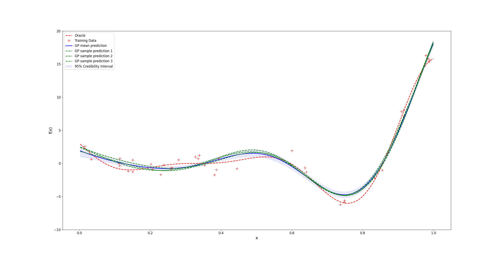
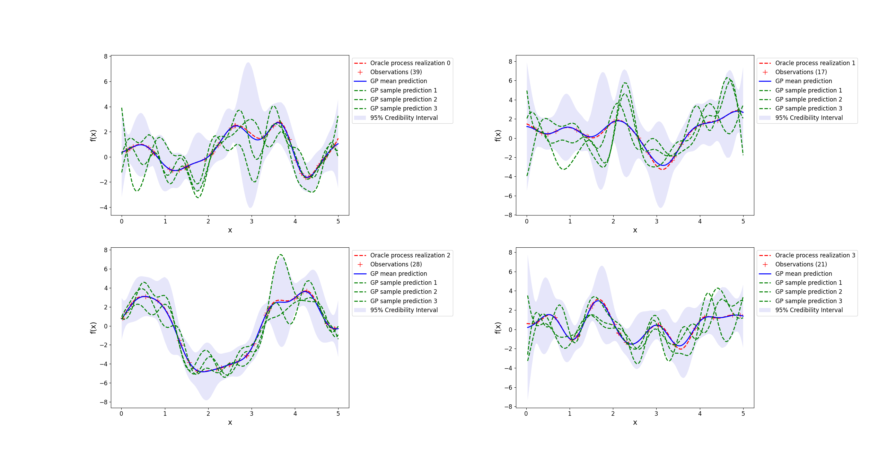

# MiniGauss: a numpy-only Gaussian Process library

## Introduction

I built this library to learn about Gaussian Processes and their optimization. The code is highly
extensible and adding prior mean/covariance functions is easy as cake! They can be added with
minimal code:

```python

from minigauss.priors  implement CovariancePrior, MeanPrior

class MyCovariancePrior(CovariancePrior):
    def __init__(
        self,
        parameter_bound: Bound = Bound(1e-3, 10),
    ) -> None:
	super().__init__({"parameter": parameter_bound})

    def _covariance_mat(self, x: np.ndarray, y: np.ndarray) -> np.ndarray:
	K = ...
	return K

    def _compute_gradients(self, x: np.ndarray, y: np.ndarray) -> None:
        self._grads = {...}


class MyMeanPrior(MeanPrior):
    def __init__(self, parameter_bound: Bound = Bound(-20, 20)) -> None:
	super().__init__({"parameter": parameter_bound})

    def __call__(self, x: np.ndarray) -> np.ndarray:
	return self.parameter * x

    def _compute_gradients(self, x: np.ndarray, y: np.ndarray) -> None:
        self._grads = {...}
```


To fit a prior onto training data -- that is find the hyperparameters that maximal the marginal log likelihood --
several optimization algorithms can be implemented. For now, only gradient ascent is available.

## Installation

Simply run `python setup.py install` and you're reading to go.

### Requirements
```
numpy
tqdm
```
Note that for better numerical stability and efficiency, `scipy` can be used to solve the system of
linear equations to avoid computing the inverse of the covariance matrix[^1] when computing the
posterior, as such: 
```python
gp = GaussianProcess(MyMeanPrior(), MyCovariancePrior(), use_scipy=True)
```

[^1]: https://www.johndcook.com/blog/2010/01/19/dont-invert-that-matrix/  

## Usage

**Example 1** - *Fitting a 1D function*:
```python
from minigauss import GaussianProcess
from minigauss.priors import ExponentialKernel, PolynomialFunc

def test_function_1D(x):
    return (x * 6 - 2) ** 2 * np.sin(x * 12 - 4)

NUM_TRAIN_PTS = 40
NOISE_STD = 0.9
X_RANGE = (-5, 5)

rng = default_rng()
x_train = rng.uniform(X_RANGE[0], X_RANGE[1], (NUM_TRAIN_PTS, 1))
y_train = test_function_1D(x_train)
y_train += NOISE_STD * rng.standard_normal((NUM_TRAIN_PTS, 1))
x_targets = np.sort(rng.uniform(X_RANGE[0], X_RANGE[1], (500, 1)), axis=0)

gp = GaussianProcess(PolynomialFunc(2), ExponentialKernel())
gp.fit(x_train, y_train, n_restarts=10, lr=1e-3)

# GP model predictions
f_sample1, mean, mean_var = gp.predict(x_targets)
f_sample2, mean, mean_var = gp.predict(x_targets)
f_sample3, mean, mean_var = gp.predict(x_targets)
```


**Example 2** - *Fitting a 1D stochastic process (from multiple realizations)*:
```python
NUM_TRAIN_REALIZATIONS = 5
NUM_TRAIN_PTS_PER_REALIZATION = 30
MAX_NUM_OBS_PTS = 40
X_RANGE = (0, 5)
NUM_TARGET_PTS = 400

y_train = np.zeros((NUM_TRAIN_REALIZATIONS, NUM_TRAIN_PTS_PER_REALIZATION, 1))
x_train = np.zeros((NUM_TRAIN_REALIZATIONS, NUM_TRAIN_PTS_PER_REALIZATION, 1))
for i in range(NUM_TRAIN_REALIZATIONS):
    x_train[i, :] = np.sort(
        (rng.uniform(X_RANGE[0], X_RANGE[1], (NUM_TRAIN_PTS_PER_REALIZATION, 1))),
        axis=0,
    )
    y = myStochasticProcess.sample(x_train[i]) # Replace this with any process you can measure
    y_train[i, :] = np.expand_dims(y, axis=1)

# Defining our GP that we want to fit to the data (to hopefully learn the oracle hyperparameters)
gp = GaussianProcess(ConstantFunc(bounds=Bound(-1, 1)), ExponentialKernel())
# Training the gp: to keep things simple in the library, let's merge all data points into one
# training set.
gp.fit(
    np.vstack(x_train),
    np.vstack(y_train),
    n_restarts=20,
    max_fast_iterations=100,
    lr=1e-3,
)

x_rlz = np.sort(rng.uniform(X_RANGE[0], X_RANGE[1], (NUM_TARGET_PTS, 1)), axis=0)
# One realization of the true process we want to model (this wasn't seen during training):
y_rlz = myStochasticProcess.sample(x_rlz)
# Pick some observations from this process realization:
n_obs = np.random.randint(3, MAX_NUM_OBS_PTS)
idx_obs = np.sort(np.random.permutation(NUM_TARGET_PTS)[:n_obs], axis=0)
x_obs = x_rlz[idx_obs]
y_obs = np.expand_dims(y_rlz[idx_obs], axis=1)

x_tgts = np.sort(rng.uniform(X_RANGE[0], X_RANGE[1], (NUM_TARGET_PTS, 1)), axis=0)

# GP model predictions for these observations. The GP is not re-trained!
gp.observe(x_obs, y_obs)  # Recomputes K, K_inv, mu and set gp._x, gp._y
f_sample1, mean, mean_var = gp.predict(x_tgts)
f_sample2, mean, mean_var = gp.predict(x_tgts)
f_sample3, mean, mean_var = gp.predict(x_tgts)
```



Have a look in the examples folder!


## TODO

- [x] Optimization of log marginal likelihood for hyperparameter tuning of priors
- [ ] Optimization algorithms
	- [x] Gradient ascent
	- [ ] Quasi-newton methods
    - [ ] ...
- [ ] Multiprocessing for faster initial points search
- [ ] Implement kernel functions
	- [x] Exponential
    - [x] Periodic
	- [ ] Matern
	- [ ] ...
- [ ] Implement mean functions
	- [x] Polynomial
	- [x] Constant
	- [ ] ...
- [ ] 2D examples
